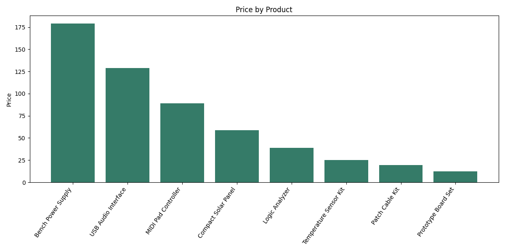

# Product Web Scraper

[](https://github.com/majdbenchobba/ai-web-scraper/actions/workflows/tests.yml)

Extract products from HTML with explicit CSS selectors, then save a CSV, summary,
and charts. Try the bundled fictional catalog without visiting a website.

## Install

Python 3.11 or newer is required. Install the v0.1.0 wheel in a virtual environment:

```bash
python -m pip install "https://github.com/majdbenchobba/ai-web-scraper/releases/download/v0.1.0/majd_product_scraper-0.1.0-py3-none-any.whl"
```

Or install the downloaded wheel from the [release page](https://github.com/majdbenchobba/ai-web-scraper/releases/tag/v0.1.0):

```bash
python -m pip install ./majd_product_scraper-0.1.0-py3-none-any.whl
```

## Try it in one command

```bash
product-scraper --demo
```

The offline demo reads eight fictional products bundled with the package and
writes these files to `demo-output/`:

- `scraped_data.csv`
- `summary_report.txt`
- `price_chart.png`
- `rating_chart.png`

No network requests are made in demo mode. Products, prices, and ratings are
invented demonstration data, not real offers.



Choose another directory or skip charts:

```bash
product-scraper --demo --output-dir my-demo --skip-charts
```

The demo uses its fixed catalog selectors and dot-decimal format. Custom selector
and number-format options apply to URL scraping.

## Scrape an HTML product page

Put URLs you are authorized to scrape in `my_urls.txt`, one per line, then use
selectors matching that site's product cards:

```bash
product-scraper --urls-file my_urls.txt --container-selector ".product-item" --title-selector ".product-title" --price-selector ".product-price" --rating-selector ".product-rating"
```

The default output directory for URL scraping is `output/`. A URL file is required;
the program does not silently request placeholder websites.

This is a selector-driven HTML tool. It does not run browser JavaScript, discover
selectors automatically, or bypass access controls. A failed request or invalid
number format stops the run with an error.

## Number formats

The default decimal separator is `.`: `$1,249.50` becomes `1249.5`.
For pages using a decimal comma, pass `--decimal-separator ","`. Both
`1 249,50 EUR` and `1.249,50 EUR` then become `1249.5`; a rating of `4,7 / 5`
becomes `4.7`.

The setting applies to prices and ratings. Thousands groups must contain three
digits. A value such as `1,249` follows the explicit setting: `1249` with decimal
`.` and `1.249` with decimal `,`. Use separate runs for different number formats.

## Desktop interface

```bash
product-scraper-gui
```

The desktop interface needs Tkinter, included with standard Python installers on
Windows and macOS. Some Linux distributions package it separately. It supports
URL entry, selector and decimal-format settings, preview, and export.

## Source checkout and tests

```bash
python -m pip install -e .
python -m unittest discover -s tests -v
python -m product_scraper --demo
```

Legacy launch commands remain available from the repository:

```bash
python all_in_one_scraper.py --demo
python ui.py
```

CI runs the tests on Python 3.11, 3.12, and 3.13, builds and checks the wheel/source
archive, and runs the installed wheel's offline demo outside the checkout.
Tests use local fixtures and mocked requests.

## Responsible use

Use URL scraping only where you have permission. Follow the site's terms and
request limits, and avoid personal data or authenticated pages.

Released under the MIT license. See [CHANGELOG.md](CHANGELOG.md) for v0.1.0.
